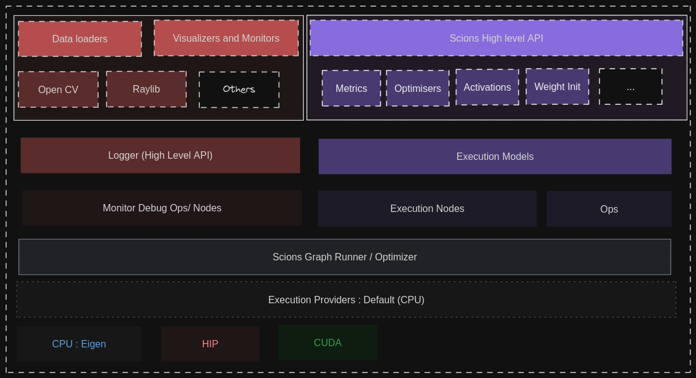

## Scions : A cpp ML library because why not

Scions aims to be a refreshingly fast and optimised way of writing which is very simple to understand and extend.

### Why another ml library in cpp ?

So there are two part answers for this, 1st being "*why another ML library?*" the answer is 

- I wanted to learn more about how the theoretical and implementation level machine learning works. The best way of doing it is to 
make a ML library itself because you get to actually read and implement the details rather than just relying on other frameworks
to make the **Magic Happen**. Also, I would get to learn how to build actual low level library for executing parallel and
and performant opCode in different accelerator environments.
- There are certain limitation in different runtimes provided by big frameworks like **Tensorflow**, **Pytorch** and
*(Although to a less extent)* **Onnx Runtime** which are hard to overcome in a normal setting which I am trying to achieve.

Next par is *"why a library in cpp""* 

- that is rather good question because while it is true that most of the current ml work is being done in python but 
there is a massive incentive to use low level language if much of optimisation can be done. Most python libraries are implemented
in low level languages like cpp because its simply not possible to do it in other language efficiently for different reasons.

### Who is this library for ?
To be honest at this point I don't know other than me but hopefully overtime it gets enough features that most usecases can
be possible.

- This library is not intented to be used as actual general purpose ML library, as it is developed to meet my use case.
- For people who do try the devil's path it will be very hard to overcome the missing **supporting** libraries like for 
**visualisation** and **data processing** that is very easily available in python.

### Intended Architecture of Scions
This is the current plan, Onnx Runtime is the biggest inspiration while bulding this.

